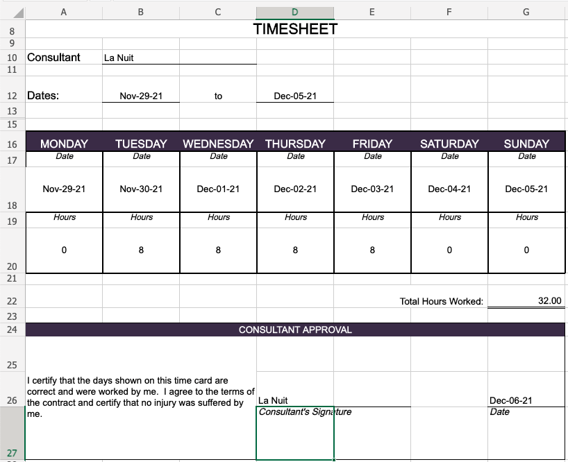

# timesheet-generator

Fill/Update an Excel file (.xlsx) with the last week work hours.

This is an example of an Excel Timesheet:



- Template file must be present in the `files/` folder.
- Template file name must start with 2 digits `00`.
- Template file name must end with a date in format `2021-12-25`.

Good Example: `00-RS_timesheet_format_2021-09-13.xlsx`

```bash
monday 88888

# Date         Hours
# ---------  -------
# Dec-06-21        8
# Dec-07-21        8
# Dec-08-21        8
# Dec-09-21        8
# Dec-10-21        8
# Dec-11-21        0
# Dec-12-21        0
# ---------  -------
#    Total:   40 hrs
```